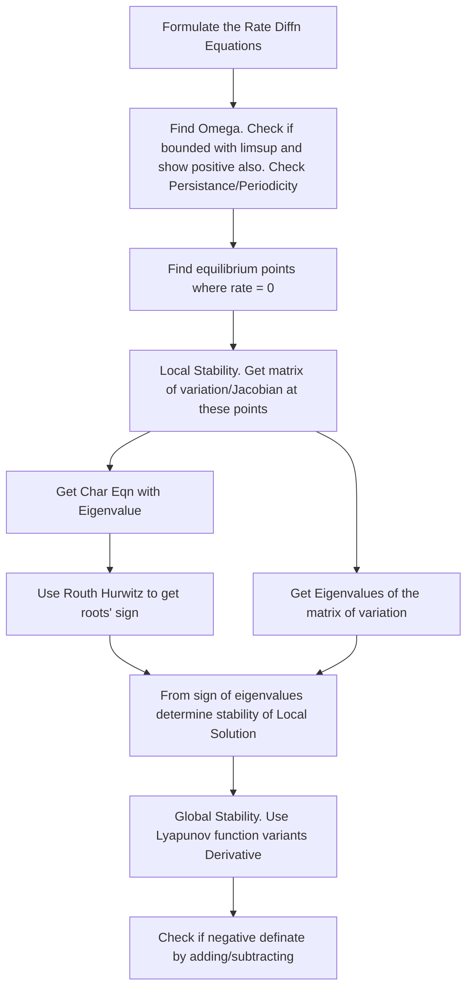

### Important Topics

- [Routh Hurwitz Test](https://www.math24.net/routh-hurwitz-criterion/)
- Matrix of Variation/Jacobian of dx/dt (and dy/dt)
- Stability of solution
    - Local Stability (Matrix of Variation) Eigenvalues
        - Positive Definate : Unstable
        - Negative Definate : Local AS
        - Imaginary Eigenvalues: Spiral
    - Global Stability (Appropriate Lyaponov Function)
        - Test stability by Lyapunov Funcn or any other (V) has derivative negative definate

$$V(x) = x - x^* - x^*ln(\frac{x}{x^*}) \frac{k_1}{2}(T- T^*)^2 + \frac{k_2}{2}(U-U^*)^2$$
$$\frac{dV}{dt} = \frac{\dot{x}}{x}( x - x^*) + other$$

- Quick Finding of Eigenvalues (see Prerequisites)
- Complex Eigenvalues and Calculation of Spiral
- Linearization of Solution
- Logistic regression Model
$$ \frac{dx}{dt} = rx(1 - \frac{x}{k})$$
- Persistance / Permanance of Solution
- Picard-Landlof Theorem - Existence of Solution
- Sylvester's Criteria - b^2 - 4ac conditions
- Hamiltonian
   $$ H(x, t, u, \lambda) = g_{divident}(x, t, u) + \lambda f_{capital\ assets}(x, t, u) $$
- Pontrayagin's Maximum Principle
$$ \frac{d\lambda}{dt} = -\frac{dH}{dx}$$
- Bang-Bang and Singular Control (Control Theory)
- De Carte's Rule of Sign
- Dulac Bendixson Criteria for periodicity of soln
- Bionic Equilibrium Conditions (for Optimal Harvesting)
- Hopf Bifurcation: The point where behavior of system stability changes. Opposite stability before and after critical value.
- Lebesgue Cycle Stability
- Basic Reproduction No.
- LimSup Method for showing boundedness
- Standard Comparison Theorem, Amax > Bmin, well-posedness ...

---

### Models
1. Malthusian Growth Model
$$ dx/dt = rx$$
2. Logistic Growth Model (inter-specific interference)
3. Resource-Consumer and similar models -
    - Prey-Predator Model (or Resource Consumer)
        - specialized prey-predator
        - generalized prey-predator
    - Competetive Model
    - Cooperation Model
4. 3 Species Food Chain Model
(Logistic Growth with interspecie interface)
5. Opimal Harvesting (fish) Model - Max Sustainable Yield
6. Migration of Fishes Model
7. Pollution Toxicant Models-
    - 2D Model
    - 3D Model - Uptake of Conc (POST-Midsem)
8. Susceptible-Infected and variant models
    - SI Model
    - SIS Model(with immunity)
    - SIR Model(with complete cure forever)
    - SEIR Model(Both Exposed and Recovery types)

#### Analysis of Solution

- Boundedness
- Positivity and Solution Space $\Omega$
- Persistance of Solution (Show Lower Bound)
- Periodicity or not (Dulac Bendixson Criteria)
- Equilibrium Points
- Local Stability Analysis
    - Linearize solution and then find values OR...
    - Use generalized matrix of variation and plug in values
- Global Stability Analysis
    - Choose Lyapanov Function and terms based on Logistic Growth or not
    - Differentiate and show Negative Definate
    - Use Sylvester's Criteria and compare terms using Routh-Hurwitz Criteria
    - Routh Array to show stability

#### Other Analysis Techniques

- Rate $\dot{r}$ for growth and $\dot{\theta}$ for clockwise/anticlockwise in spirals
- Lebesgue Cycle stability in spirals
- Critical points in Hopf Bifurcation and stability chart
- Basic Reproduction Number Calculation

---

#### Sample Model to check equilibrium points

#### Harvesting Model Sample Flow
Steps for Solving
   1. Formulate the Rate Diffn Equations
   2. Find the equilibrium points and conditions
   3. Plug x* value in harvesting rate equation qEx
   4. Get max E by finding minima at x* and put the value into harvesting rate

For optimal harvesting policy,

   5. Find hamiltonian with 
        - f as *net revenue in continuous time stream*
        - g as *rate of change of assets*
   $$ H = e^{-\delta t}(pqx-c)E + \lambda_1 \frac{dx}{dt} +\lambda_2 \frac{dy}{dt}$$
   6. Find **minima of H wrt. E** .Get switching func and equate to 0 for singular control
   7. Apply Pontrayagin's Max Principle Condition and use with step 6.
   8. Find discount value and check notes of these points

Bionic Equilibrium is value of E at 
$$\dot{x} = \dot{y} = 0$$

---

#### SIR Model

Steps for Solving,

1. Show Bounded by taking sum of population(N) and finding LimSupN(t) will be const
2. Take S(t) and with Comparison Theorem, show >=0
3. Use Dulac Bendixson with H = 1/SI, and show no sign change so not periodic
4. Find Equilibrium Points (approx E*) with reproduction no. 'R'
5. Matrix of Variation with 'R' cases
6. Lyapunov Function and one term will not allow sylvester's criteria
7. Choose C = S* to get,
$$  \dot{V} = -\beta I (S-S^*) -\beta S^* (I-I^*)(S-S^*) < 0 $$

#### Other Useful Prerequisites 

- Green's Thm
- Stoke's Thm
- Gauss Divergent Thm
- Finding Eigenvalues fast
$$ \lambda^2 - Tr(A)\lambda + Det(A) $$
*Trace is sum of diagonal entries*
- Routh Hurwitz Criteria
    See [Routh Hurwitz Test](https://www.math24.net/routh-hurwitz-criterion/)
    - Conditions
        - All positive coeff always
        - All minors must be positive
        - 2nd Degree: no more conditions
        - 3rd Degree a1\*a2 - a3\*a0 > 0 (for 3 degree see below)
$$
     Routh\ Array =
\begin{bmatrix}
    a_{N} & - a_{N-2} \\
    a_{N-1} & a_{N-3} \\
\end{bmatrix}
$$

-   Another view to understand [Routh Hurwitz Graphical](https://youtu.be/WBCZBOB3LCA)
    - Background
        - If one sign different => one is positive. Hence unstable.
        - If all negative => same as all positive coeff
