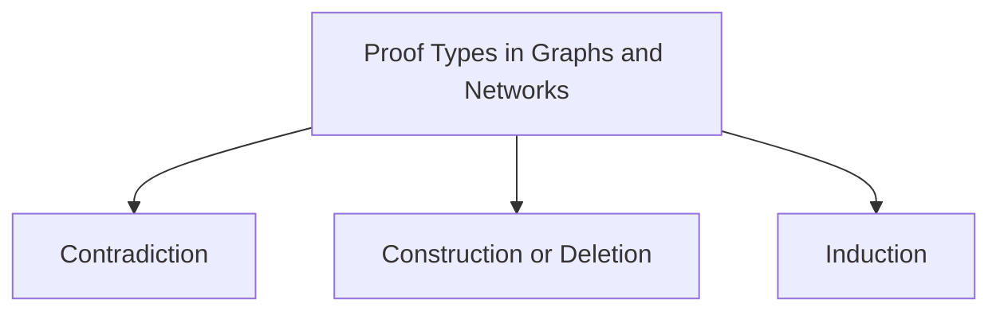
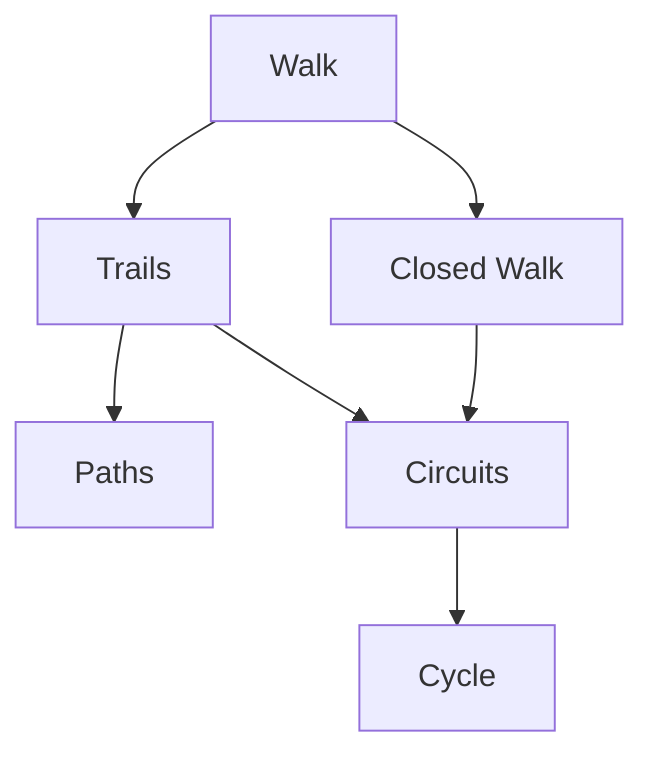
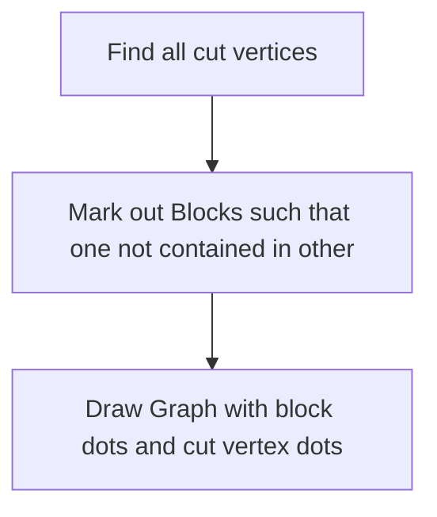

Graphs and Networks
========================

<link href="http://thomasf.github.io/solarized-css/solarized-dark.min.css" rel="stylesheet"></link>

### List of Algorithms

1.  Minimum Spanning Trees
    - Krusikal's (Any point but min with no cycle)
    - Prim's (From starting point)

2.  Graph Traversal Techniques
    - BFS
    - DFS
    - Djkstra's Shortest Path
    - Apply DFS for checking cut vertex

3.  Eulerian/Hamiltonian Graphs
    - Eulerian Graph even degree
    - Fleury's Algorithm
    - Closure of Graph
    - Sufficient conditions of Hamiltonian Graph (and Restricted
        Hamiltonian Algo)

4.  Travelling Salesman Problem
    - TSP1- From weight matrix, draw tables
    - TSP2 - Take min span, DFS from leaf node and join all endpoints

5. Network Flow Algo

### Proof/Question Hints

*Taking two techniques at a time is key to success.*

- Subtract edge/vertex and add back! (construction or deletion)
    - not cut edge/vertex e/v => G - e/v is connected
    - make cycle and take another edge
- Take Longest path in graph (delete or not)
- Check type of cycles in graph
- Adjacency Matrix, Caylay Matrix, Graph Laplacian and Incidence Matrix based approach
- Number of components more or less (cut-edge, hamiltonian...)
- If cycle length 2, Bipartite
- Planar = draw planar drawing
- Non-planar
    - Euler's Formula or 5-degree or variants(girth-analysis)
    - Check any Subgraph non-planar
    - Kuratowski and/or Wagner 
- If no triangles, then relation between q & r (where q unrestricted)

### List of Theorems

1. Isomorphic if complement is isomorphic
1. Every tree (with >= 2 vertices) has >=2 leaves
1. Simple G with n vert, k components, has atleast n-k edges
1. Characterstics of Tree
1. If G has walk, G contains path
1. Every closed odd walk contains odd cycle
1. **Bipartite iff no odd cycle**
1. Kirchoff's Matrix-Tree Thm
1. Caylay Thm
1. Euler even degree (and disjoint cycle) thm
1. Whitney's Thm
1. Euler's Planar Graph Formula and Thm
1. Max Planar Graph thms using Girth Formula
1. Planarity of Graphs - Kuratowski and Wagner Thms
1. Graph Coloring
    - Simple graph with K-blocks has max chromatic no. of blocks
    - For any simple graph, max chromatic no. < max degree + 1
    - Five Color Theorem (Step towards of 4 Color Thm)

### Week Wise Review

#### Week 1 

- Types of Graphs
- Graphical Sequence Algorithm
- Degree Sum and Edges relation
- Neighbourhood (open/close)
- k-regular graphs
- Isomorphic or not
- Subgraphs and Induced Subgraphs

##### Types of Graphs

- Null
- Complete
- Bipartite
- Complete Bipartite
- Cycle
- Path
- (Graphs n = 1, 2 vertices)
- (self-compliment Graphs)
- (planar graphs)

#### Week 2

See Examples for each Case!

- walk : anything from start_vertex to end_vertex
- trail: edges distinct
- path: vertices distinct
- closed walk: start_vertex = end_vertex

- Connectivity, Components
- Cut-Edge, Cut-Vertex
- Contraction of graph, minor of a graph (Contraction)
- Weakly/Strongly Connected

##### Isomorphic Graphs 

- Odd/Even Cycles and/or biparitite
- Compliment Isomorphism

#### Week 3

- Trees, Forests (star, path)
- Represent arithematical equations graphically
- Every tree has k leaves
- G contains atleast $E - V + 1$ cycles
- Characterstics of Tree (see proof)
- distance: shortest u,v path in tree (don't count start!)
- eccentricity: max of distance between all u-v path for u
- diameter: max of eccentricites of all vertices (farthest two points)
- center: point with min eccentricity
- radius: min of eccentricities (or eccentricity of center)
- rooted trees, ordered rooted trees, parent, child, ancestor, descendants, siblings
- Binary trees, Regular binary trees (deg 3 or less)

#### Week 4
_Mostly Contradiction Proofs_

- wiring, spanning trees, spanning forests
- Three main types of Matrices
    - Adjacency Matrix: (V, V) based and shows no. of edges between each pair of vertices (1 or 0 only for simple graphs)
    - Incidence Matrix: which edges are incident for each vertex (V, E)
    - Graph Laplacian: Degree of vertices along diagonal. -1 wherever edge. 0 wherever no edges. See [graph laplacian video](https://youtu.be/PFE3VMsR2AU)
- Kirchoff's Matrix-Tree Thm

- Minimum Cost Spanning Trees, Weight Func
- Krusikal and Prim's Min Spanning Tree finding algo

#### Week 5

- Edge Based 
    - eulerian trail( _n-2 even 2 odd_ )
    - eulerian circuit (_all even_)
    - eulerian graph (contains eulerian circuit)
- Euler-Path finding algorithm (and proof of even degree)
- Fleury's Algo
- Hamiltonian path, hamiltonian graph, sufficient conditions for hamiltonian graph

_Hamiltonian Cycle is just another way of saying subgraph Cn!_
- Hamiltonian closure and finding hamiltonian graphs
- TSP1 and TSP2 graph algos

#### Week 6

- Connectivity, edge cuts, k-edge-connected(returns bool), edge-connectivity (returns int connectivity)
- Vertex Connectivity, Vertex-Cut Set, min degree, max degree
- Whitney's Thm

#### Network Flows and Related Topics (Week before Midsem)
 
- Flow - flow, capacity, source, sink
- Maximum Flow Problem: Ford-Fulkerson Algo, Residual Graph, Augmented Paths
- Min Cut Problem: S-T cut, Cap(A, B), Cut where Residual Graph paths end
- Flow value Lemma (same as out of source)
- Max-Flow Min-Cut Thm 
$$ val(f) = \sum_{out\ of\ a} f(e) - \sum_{in\ to\ a} f(e) = \sum_{out\ of\ a} f(e) = cap(A, B)$$
- Disjoint Paths - Ford-Fulkerson with capacities all 1
- Menger's Thm - Min no. of vertices required to be removed to disconnect u-v path
- k-connected <--> k-vertex disjoint paths

###### Blocks and Block Diagrams

#### Week 7

- Planar Graphs, Planar Embeddings
- Planar Drawing
- Face, Boundary
- Euler's Graph Formula p - q + r = 2
- Maximal Planar Graphs and Girth Formula
$$ \frac{g(n-2)}{g-2}$$
- Homeomorphic and Subdivisions
- Kuratowski and Wagner Thms
- Duality / Dual Plane
- Crossing Number

###### Kuratowski/Wagner Thm

#### Week 8

- Chromatic Number of Graph, k-colorable
- Chromatic No. of Blocks thm and max degree + 1 thms
- Booke's Thm Neither Complete nor odd cycle < max degree
- 5 Color Thm (Towards 4-color)
- Edge Chromatic No. and Thm for Bipartite graphs and simple graph

#### End Part

| Notation | Number |
| --- | --- |
|$\alpha$  | Independence No. |
|$\alpha'$ | Matching No. |
|$\beta$   | Vertex Covering No.|
|$\beta'$   | Edge Covering No.|
|$\gamma$   | Domination No. |
|$\omega$   | Clique No. |
|$\chi$    | Chromatic No.|
|$\chi'$    | Edge Chromatic No.|
|$\kappa$    | Vertex Connectivity No.|
|$\kappa'$    | Edge Connectivity No.|
